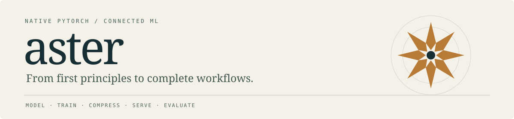
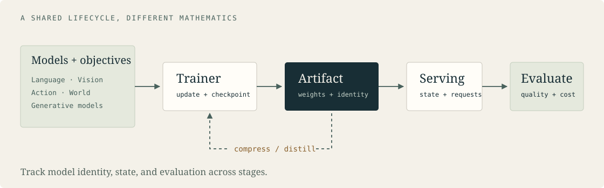

  

  <strong>Understand the model. Own the training loop. Follow it into serving.</strong>

  English · <a href="README.zh-CN.md">简体中文</a> 
  <a href="docs/GETTING_STARTED.md">Quickstart</a> ·
  <a href="docs/LEARNING_PATH.md">Learn</a> ·
  <a href="docs/ALGORITHMS.md">Algorithms & papers</a> ·
  <a href="docs/STATUS.md">Status & remaining work</a> ·
  <a href="docs/ROADMAP.md">Roadmap</a> ·
  <a href="docs/README.md">Documentation</a> ·
  <a href="CONTRIBUTING.md">Contribute</a>

---

Aster is a native PyTorch framework for studying and building **connected ML workflows**: models, objectives, training, compression, inference, agents, and evaluation. Read the equations in small implementation modules, test their behavior, then follow the same components into an end-to-end recipe.

**[v0.1.0 — First release](https://github.com/sutiankang/aster/releases/tag/v0.1.0).** Explore the implementations and runnable examples below. APIs are experimental; see [current status](docs/STATUS.md) and [the roadmap](docs/ROADMAP.md) for supported features and remaining work.

| Implemented paths | Still to implement | Still to verify | Licensing and governance work |
| --- | --- | --- | --- |
| Native models/objectives, shared training, linear LoRA, supported serving and evaluation workflows | Advanced adapters, broader parallel/serving combinations, remaining agent capabilities | Multi-node GPU behavior, hardware performance, public pretrained quality | License clearance, file-level source review, maintainer governance |

## Start here

| Your goal | Best entry point |
| --- | --- |
| Run something on a CPU | [Train and merge a tiny LoRA model](examples/quickstart.py) |
| Understand the code, step by step | [Learning path: questions, files, experiments](docs/LEARNING_PATH.md) |
| Find an algorithm or its official source | [Algorithm map](docs/ALGORITHMS.md) |
| Connect training to deployment | [Runnable workflow gallery](docs/EXAMPLES.md) |
| Check whether a feature fits your use case | [Current status](docs/STATUS.md), [roadmap](docs/ROADMAP.md), and [model details](docs/MODELS.md) |

## A first experiment

With Python 3.11+ and a compatible PyTorch installation, clone the repository and enter its directory. If you already have a checkout, skip the first two commands:

~~~bash
git clone https://github.com/sutiankang/aster.git
cd aster
python -m pip install -e ".[test]"
python -m aster doctor
python examples/quickstart.py
~~~

This CPU example trains a tiny LoRA adapter, checks that the base weights remain unchanged, and compares merged and unmerged outputs. No model downloads, API credentials, or GPU are needed.

Want to read the implementation first? Follow [LoRA](src/aster/methods/distillation.py) → [supervised loss](src/aster/methods/supervised.py) → [Trainer](src/aster/training/trainer.py) → [the test](tests/unit/test_repository.py).

## One connected stack

The shared contract is deliberately small: models compute tensors; objectives return loss sums and valid counts; the trainer owns updates and checkpoints; artifacts connect training, deployment, and evaluation.

Three examples show that connection:

| Workflow | What you can inspect | Run from the repository root |
| --- | --- | --- |
| LoRA → shared-base serving | Adapter ownership, INT8 paged KV, host swap and cleanup | python examples/online_adapter_stack.py --kv int8 |
| Teacher → student → evaluation | Training, distillation, immutable artifacts and a fixed evaluation protocol | python -m aster run examples/recipes/language_chain.json --output runs/language-001 --store artifacts |
| Model → objective → update → merge | The smallest complete fine-tuning loop | python examples/quickstart.py |

These examples use tiny models and synthetic data. They demonstrate executable workflows, not leaderboard quality or GPU throughput. The [workflow gallery](docs/EXAMPLES.md) explains inputs, expected checks, and where to change the code.

## What can I study or build?

| Area | Selected native implementations | Explore |
| --- | --- | --- |
| Language models | GPT-2, Llama/Qwen families, DeepSeek MLA/MoE, Mamba and hybrid recurrent attention | [Models](docs/MODELS.md) · [attention map](docs/ALGORITHMS.md#attention-and-language-models) |
| Multimodal & action models | CLIP/SigLIP, LLaVA, Qwen-VL, BLIP-2, OpenVLA, ACT and action-flow components | [Model boundaries](docs/MODELS.md) · [algorithms](docs/ALGORITHMS.md#multimodal-and-action-models) |
| Generative models | DDPM/DDIM, EDM, flow matching, consistency, MeanFlow, Shortcut and Drifting components | [Methods](docs/METHODS.md) · [algorithms](docs/ALGORITHMS.md#generative-models-and-compression) |
| World models & planning | RSSM, PlaNet, JEPA/LeWM, MuZero and search/planning components | [Algorithms](docs/ALGORITHMS.md#world-models-and-planning) |
| Training & fine-tuning | Shared multi-role trainer, LoRA, Muon, accumulation, EMA, checkpointing, supported parallel/ZeRO layouts | [Training](docs/TRAINING.md) · [fine-tuning](docs/FINE_TUNING.md) |
| RL & distillation | DPO/IPO/SimPO, PPO/GRPO/RLOO, offline RL, token/feature/generative distillation | [Loss catalog](docs/LOSSES.md) · [methods](docs/METHODS.md) |
| Inference & agents | Paging, prefix reuse, continuous batching, low-bit KV, speculative decoding, bounded tools and selected MCP capabilities | [Inference](docs/INFERENCE.md) · [agents](docs/AGENTS.md) |
| Evaluation | Native metrics, fixed cohorts, optional official adapters, paired quality/resource comparisons | [Benchmarks](docs/BENCHMARKS.md) |

Each name has a specific implementation boundary. See the [algorithm map](docs/ALGORITHMS.md) for **idea → code → test → primary source**, and the [capability manifest](docs/scope/capabilities.json) for finer-grained status.

## Learn by changing one thing

The [learning path](docs/LEARNING_PATH.md) starts with tensors and next-token prediction, then moves through LoRA, loss normalization, caching, generative objectives, and distributed training. Each stage includes a small experiment and an observable result.

<strong>Suggested first questions</strong>

- Why does a zero-initialized LoRA B matrix preserve the base model?
- Why is the sum of token losses divided by the total valid-token count?
- When should cached decoding agree with a full-sequence forward pass?
- Why can a frozen teacher still need gradients with respect to its input?
- What changes when tensor parallelism, data parallelism, and ZeRO are composed?
- Why does a faster approximate sampler still need a quality comparison?

Start with [the guided answers and exercises](docs/LEARNING_PATH.md), then open the linked implementation and test side by side.

## Where Aster fits

Aster is useful when you want readable native implementations, explicit mathematical contracts, and connected experiments. Core runtime computation stays in this repository; official packages are optional reference/evaluation dependencies.

It is not a drop-in replacement guarantee for Transformers, Megatron, DeepSpeed, vLLM, or Codex. QLoRA, DoRA, rsLoRA and IA³ are not implemented. Multi-rank continuous HTTP serving, complete MCP coverage, broad hardware performance validation, and public pretrained-quality evidence remain work in progress. See [the roadmap](docs/ROADMAP.md).

## Reproduce, then extend

~~~bash
python tools/check_repository.py
python -m pytest tests/unit tests/integration -q
python -m pytest tests/distributed -q
~~~

Reference-source comparisons and CUDA cases have explicit extra requirements. Skips remain skips. See [test tiers](docs/TESTING.md) and [benchmark protocols](docs/BENCHMARKS.md).

For contributions, start with a reproducible example, an independent correctness test, or a clearer explanation. [Contributing](CONTRIBUTING.md) · [Support](SUPPORT.md) · [Security](SECURITY.md) · [Code of conduct](CODE_OF_CONDUCT.md)

If Aster helps you learn or build, consider [giving it a star ⭐](https://github.com/sutiankang/aster). It helps other learners discover the project.

Tell us which workflow you used. A useful example or a carefully explained failure is a valuable contribution.

## Star History

<a href="https://www.star-history.com/?repos=sutiankang%2Faster&amp;type=date&amp;legend=top-left">
  <picture>
    <source media="(prefers-color-scheme: dark)" srcset="https://api.star-history.com/chart?repos=sutiankang/aster&amp;type=date&amp;theme=dark&amp;legend=top-left&amp;sealed_token=MXuvH6lDouerBkulGFKjPEiHgmv23NAZopEDUhWLnRlbAiZZcun53-YWdB_efQw7pMSHPkPb9UtruD_gvL6vU4lt7CxdGHHcx2vn8-d_70LBPI5D4_WsQexE_eJyKKaYJyYQdMZqe6Hx1PG012VLGbZn9bUiIdcHCMFcggAEthqAeQRY0iwE6Lya3Lp3" />
    <source media="(prefers-color-scheme: light)" srcset="https://api.star-history.com/chart?repos=sutiankang/aster&amp;type=date&amp;legend=top-left&amp;sealed_token=MXuvH6lDouerBkulGFKjPEiHgmv23NAZopEDUhWLnRlbAiZZcun53-YWdB_efQw7pMSHPkPb9UtruD_gvL6vU4lt7CxdGHHcx2vn8-d_70LBPI5D4_WsQexE_eJyKKaYJyYQdMZqe6Hx1PG012VLGbZn9bUiIdcHCMFcggAEthqAeQRY0iwE6Lya3Lp3" />
    
  </picture>
</a>

## Acknowledgements and license

Implementation references include [Transformers](https://github.com/huggingface/transformers), [Megatron-LM](https://github.com/NVIDIA/Megatron-LM), [DeepSpeed](https://github.com/deepspeedai/DeepSpeed), [vLLM](https://github.com/vllm-project/vllm), and the algorithm authors linked in [the source map](docs/ALGORITHMS.md). These references do not imply affiliation or endorsement.

A repository-wide license has not yet been granted. See [NOTICE](NOTICE.md) for third-party terms and the ongoing source review before reusing or redistributing code. Model weights and benchmark datasets are not included and have separate terms.
